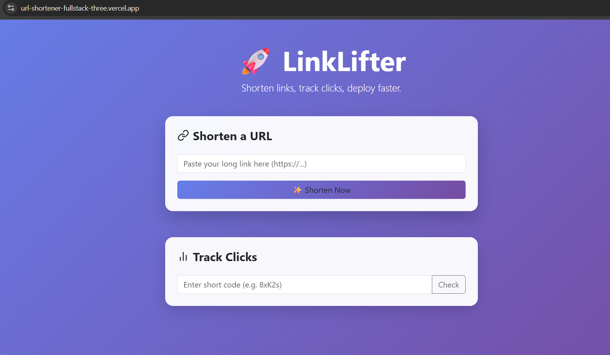

# 🚀 LinkLifter - Distributed URL Shortener Service

A production-ready, full-stack URL shortening service engineered for scalability and performance.
Built with **Java Spring Boot** and **React**, deployed as decoupled microservices using **Docker** containers on a cloud architecture.

[](https://url-shortener-fullstack-three.vercel.app/)
[]()


---

## 🖼️ Project Demo

*The modern Glassmorphism UI ensuring a premium user experience.*

---

## 🏗 System Architecture

The application transitions from a monolithic design to a **Decoupled Cloud Architecture**:

* **Frontend:** React + Vite hosted on **Vercel's Edge Network**.
* **Backend:** Spring Boot REST API containerized with **Docker** and hosted on **Render**.
* **Database:** Serverless **TiDB (MySQL)** cluster for high-availability persistence.
* **Security:** IP-based **Rate Limiting** (Bucket4j) and CORS configuration.

### 🧩 Core Algorithm: Base62
We utilize **Base62 Encoding** to generate short, URL-safe aliases from database IDs.
* **Collision-Free:** Mathematically guaranteed uniqueness.
* **Performance:** `O(1)` complexity for encoding/decoding.
* **Scale:** Can generate 3,500 trillion unique combinations with just 7 characters.

---

## 🚀 Key Features

### 🛡️ 1. API Rate Limiting (Security)
Implemented **Bucket4j** (Token Bucket Algorithm) to prevent abuse and DDoS attacks.
* **Limit:** 10 requests per minute per IP address.
* **Response:** Returns `429 Too Many Requests` with a "Retry-After" header if exceeded.

### ⚡ 2. High-Performance Redirection
* Optimized database indexing ensures **sub-100ms** lookup times.
* Validates URL syntax and checks for "HTTP/HTTPS" protocols automatically.

### 📊 3. Analytics & Tracking
* Tracks total **Click Counts** for every generated link.
* Stores visit data persistently in the cloud database.

### 🎨 4. Modern UI/UX
* **Glassmorphism Design:** Custom CSS gradients and blur effects.
* **Clipboard Integration:** One-click copy functionality.
* **Responsive:** Fully mobile-optimized layout.

---

## 🛠️ Tech Stack

| Component | Technology |
| :--- | :--- |
| **Backend** | Java 17, Spring Boot 3, Spring Data JPA |
| **Frontend** | React.js, Vite, Bootstrap 5 (Custom CSS) |
| **Database** | MySQL (TiDB Serverless Cloud) |
| **Security** | Bucket4j (Rate Limiter), CORS Policies |
| **DevOps** | Docker, Render (Cloud PaaS), Vercel |
| **Tools** | Maven, Postman, Git |

---

## ⚙️ Getting Started (Run Locally)

### Prerequisites
* Java 17+
* Node.js & npm
* MySQL (or use H2 in-memory)

### 1. Backend Setup
```bash
# Clone the repository
git clone https://github.com/Sachin-2003-hub/url-shortener.git
# Navigate to backend
cd backend

# Install dependencies & Run
mvn spring-boot:run
```
### 1. Setup Backend (Spring Boot)
```bash
# Navigate to frontend folder
cd frontend

# Install dependencies
npm install

# Start the dev server

npm run dev
```
## 🔌 API Documentation

| Method | Endpoint | Description |
| :--- | :--- | :--- |
| `POST` | `/shorten` | Accepts a raw URL string and returns the short ID. **(Rate Limited)** |
| `GET` | `/{shortCode}` | Redirects the user to the original URL. |
| `GET` | `/stats/{shortCode}` | Returns the total click count (Long). |

## 👨‍💻 Author
**Sachin [Last Name]**
* [LinkedIn](https://www.linkedin.com/in/sachin-chaurasiya-833788228/)
* [GitHub](https://github.com/Sachin-2003-hub)
